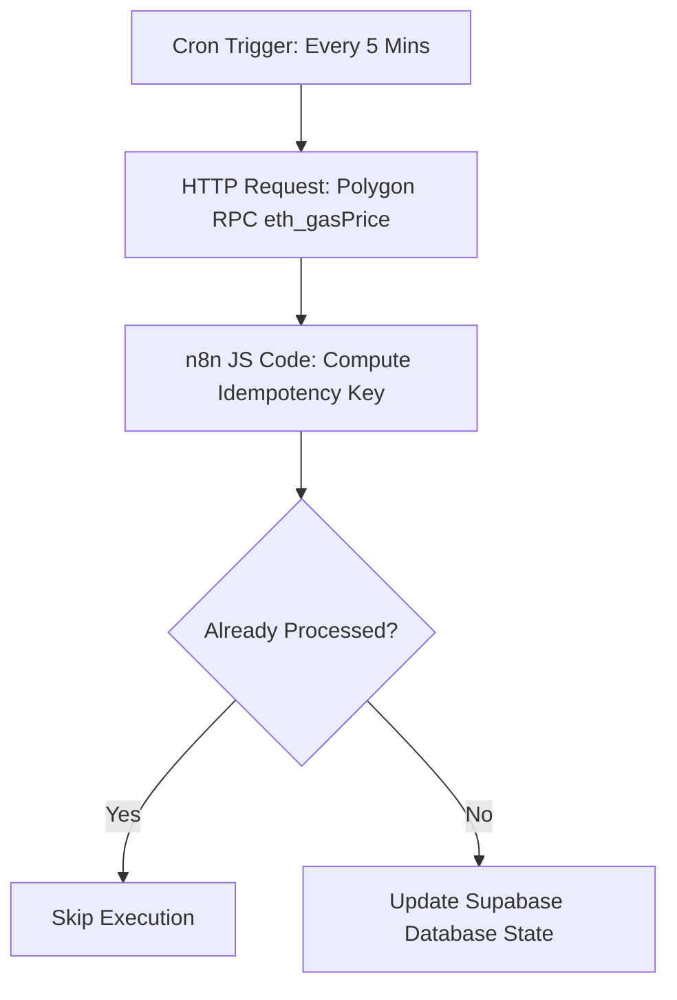

# 🔄 Truxify Multi-Oracle Gas & Escrow Sync Workflow

This n8n workflow guarantees idempotent synchronization between Polygon blockchain RPC gas price feeds, Chainlink exchange rate oracles, and backend database transaction tables.

## Features
- Multi-RPC failover fetching
- Idempotency key generation (`gas_sync_<5_min_window>`)
- Zero duplicate transaction writes
